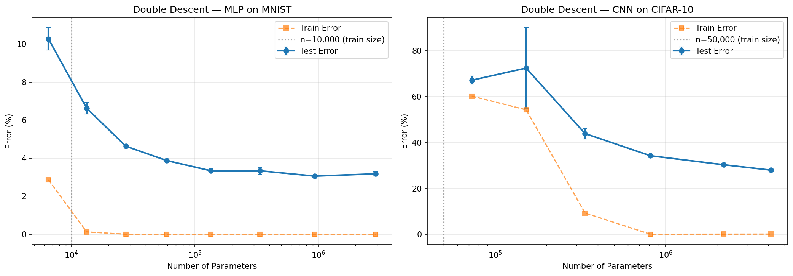
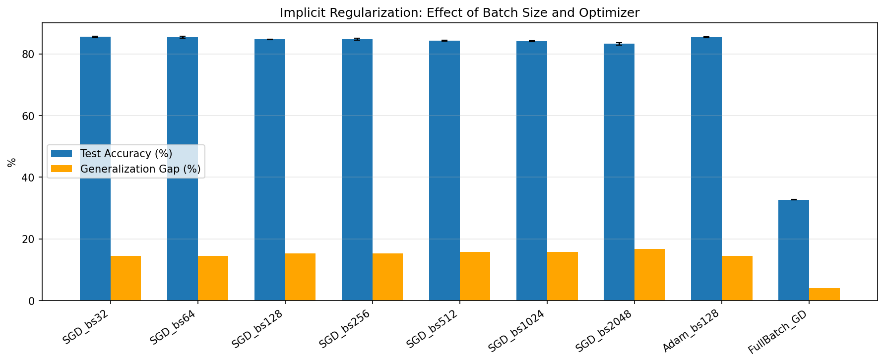
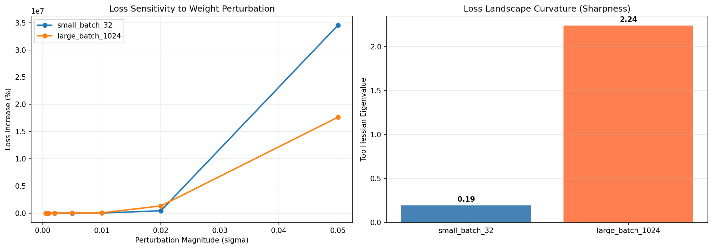
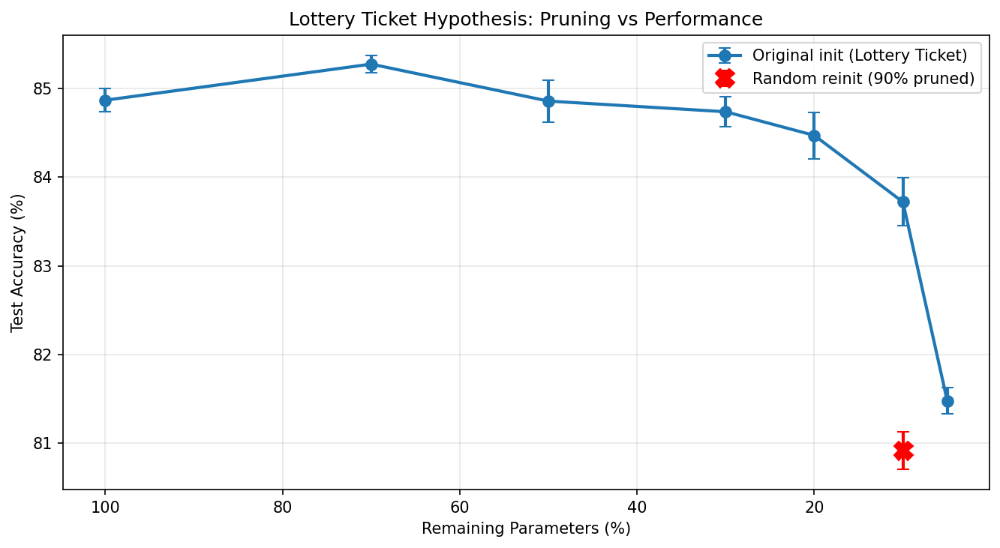
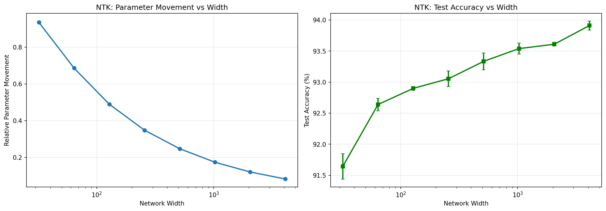

# Implicit Regularization and Generalization in Overparameterized Neural Networks

Code and experiments for the paper *Implicit Regularization and Generalization in Overparameterized Neural Networks* ([arXiv:2604.07603](https://arxiv.org/abs/2604.07603)).

Modern neural networks routinely have far more parameters than training samples, yet they generalize well. Classical learning theory says they should overfit badly. This repository runs five controlled experiments on MNIST and CIFAR-10 that probe five of the leading explanations for why they do not, and measures how they interact inside the same trained models.

The full paper is included here as [`paper.pdf`](paper.pdf).

## The five experiments

| # | Question | What it measures |
|---|----------|------------------|
| 1 | Double descent | Test error vs. parameter count across three orders of magnitude, through the interpolation threshold |
| 2 | Implicit regularization | Test accuracy and generalization gap across SGD batch sizes, Adam, and full-batch GD |
| 3 | Loss landscape geometry | Flatness of the minimum via top Hessian eigenvalue (power iteration) and weight-perturbation sensitivity |
| 4 | Lottery Ticket Hypothesis | Accuracy of sparse subnetworks retrained from their original init, vs. a random-reinit control |
| 5 | Neural Tangent Kernel regime | Relative parameter movement from initialization as network width grows from 32 to 4096 |

## Headline results

**Smaller SGD batches generalize better and land in flatter minima.** Batch size 32 reached 85.5% test accuracy vs. 83.3% at batch size 2048, with identical (100%) training accuracy. The flatter (small-batch) minimum had a top Hessian eigenvalue of 0.19 against 2.24 for the large-batch minimum, an 11.8x difference in curvature.

**Double descent shows up in both the MLP and the CNN.** Test error keeps dropping well past the point where the model already fits the training set perfectly.

**Winning tickets are real.** A subnetwork keeping only 10% of weights, retrained from its original initialization, came within 1.15 points of the full model. The same architecture retrained from a fresh random initialization was 2.80 points worse, which is the signature the Lottery Ticket Hypothesis predicts.

**Wider networks move less.** Relative parameter movement fell 11.3x (0.94 to 0.08) as width went from 32 to 4096, tracking the inverse-square-root approach to the NTK regime, while test accuracy rose slightly.

### Double descent (Exp 1)



MLP on MNIST (10k-sample subset): test accuracy keeps climbing past the interpolation threshold at width 32 (~2.8x overparameterization).

| Width | Params | Train Acc | Test Acc |
|------:|-------:|----------:|---------:|
| 8 | 6,514 | 97.1% | 89.7% |
| 32 | 27,562 | 100.0% | 95.4% |
| 128 | 134,794 | 100.0% | 96.7% |
| 1024 | 2,913,290 | 100.0% | 96.8% |

### Implicit regularization (Exp 2)



CNN (~814k params) on CIFAR-10, no weight decay or dropout, learning rate scaled linearly with batch size.

| Config | Batch | Test Acc | Gen Gap |
|--------|------:|---------:|--------:|
| SGD | 32 | 85.52% | 14.48% |
| SGD | 128 | 84.72% | 15.28% |
| SGD | 2048 | 83.27% | 16.73% |
| Adam | 128 | 85.47% | 14.53% |
| Full-batch GD* | 5000 | 32.71% | 3.95% |

\*Full-batch GD used a 5,000-sample subset. It never fit the training data (36.7% train accuracy), which is why its generalization gap is small.

### Loss landscape geometry (Exp 3)



Two identical CNNs, one trained small-batch and one large-batch. At perturbation sigma = 0.005 the large-batch model's loss rose 1,932% against 158% for the small-batch model.

### Lottery Ticket Hypothesis (Exp 4)



Iterative magnitude pruning on the CIFAR-10 CNN. Pruning 70% of weights caused no significant accuracy loss; the red marker is the random-reinit control at 90% pruning.

### NTK regime (Exp 5)



MLPs of increasing width on a 5,000-sample MNIST subset. Relative parameter movement decreases monotonically with width.

## Reproducing

Requires an NVIDIA GPU with CUDA. The original runs used an RTX 3070 Ti (8 GB); full runtime is roughly 30 to 40 minutes. MNIST and CIFAR-10 download automatically on first run.

```bash
pip install -r requirements.txt

# Exp 1 (double descent) and Exp 5 (NTK sweep)
python experiments/run_all_experiments.py

# Exp 2 (implicit reg), Exp 3 (loss landscape), Exp 4 (lottery ticket)
python experiments/refined_experiments.py
```

Each script writes JSON results and figures into `experiments/results/`. The versions committed here are the ones reported in the paper. Every experiment runs multiple seeds; results are reported as mean plus or minus standard deviation.

## Layout

```
paper.pdf / paper.tex / references.bib   The paper
experiments/run_all_experiments.py       Exp 1 double descent, Exp 5 NTK
experiments/refined_experiments.py       Exp 2 implicit reg, Exp 3 landscape, Exp 4 lottery ticket
experiments/results/                     JSON metrics and figures (committed)
```

## Setup notes

All models use SGD with momentum 0.9 (Adam where noted), cosine-annealed learning rates, ReLU, and PyTorch default initialization. No data augmentation or explicit regularization was used, so CIFAR-10 accuracies (72 to 86%) sit below state of the art on purpose: the goal is to isolate implicit effects, not to chase a leaderboard.

## Citation

```bibtex
@article{johannsen2026implicit,
  title   = {Implicit Regularization and Generalization in Overparameterized Neural Networks},
  author  = {Johannsen, Zeran},
  journal = {arXiv preprint arXiv:2604.07603},
  year    = {2026}
}
```

## License

MIT. See [LICENSE](LICENSE).
